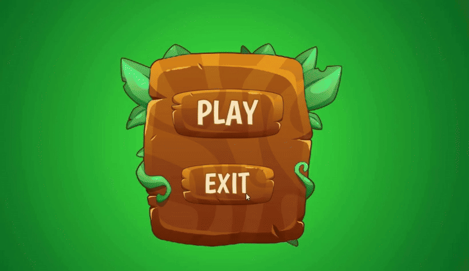
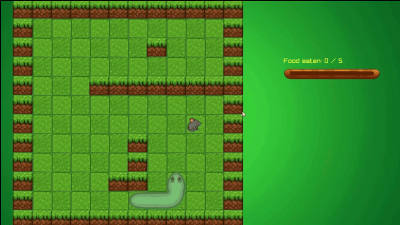
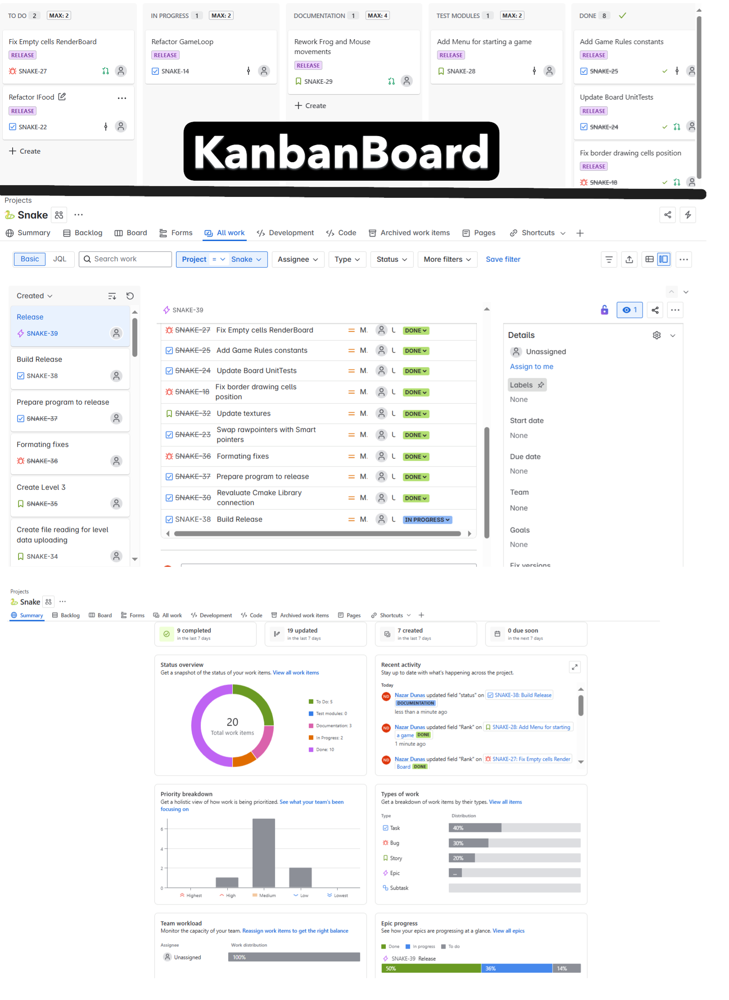

# Snake Game (C++ / Raylib)
My representaion on the classic Snake game, built in C++ with Raylib for rendering and CMake for build automation.
Includes core game logic, interactive UI, and robust unit tests using Catch2

# Features
- 🎮 W,A,S,D - controlls
- 🤖 Movable food for Snake - so it's a bit challeging :)
- 🔰 3 levels with different layout + Level cutomization (incoming feature)
- 🟢 Rendering, UI, visuals with Raylib 
- 🧪 Unit tests with Catch2
- 🧱 Used OOP Game patterns: Command, GameLoop
- 🧩 Separeted core logic from render and merging into game logic
- 📁 Clean folder structure and CMake build automation
- 📄 DoxyDocumentaion
- 📑 Clang for Code formating
- 📊 Kanban Project Managment methodology
    ## Gameplay
  
  

  

  
## How to run the game (Windows) (2.17 MB) 🕹
1) You can run game by simply launching: Install->SnakeMain.exe 

#### OR
2) Download form my [GoogleDisk](https://drive.google.com/drive/folders/1HwZNBpxQ4uty3cCsi8MkHtUCODngYnGe?usp=sharing)

##
## How to run the tests 🧪
1. Clone repository, open command console in downloaded repo
2. Run these commands: 
 - cmake -S . -B ./build
 - cmake --build ./build
 - ctests --test-dir ./build/tests --verbose
 ### OR 
You can see tests are always running after succesfull build and compilation of the program! 
##
## Project structure📂:

### Snake/

├── Assets            # Textures for game

├── external          #External libraries source files (RayLib)

├── Install/       # Game Instalation package

### ├── source/

│   ├── core/         # Game logic (Snake, Board, Food)

│   ├── render/       # Raylib rendering code

│   └── app/      # Game entry point and logic

### ├── tests/            # Catch2 unit tests

├── CMakeLists.txt    # Build configuration

└── README.md         # This file

# Kanban Project Managment methology 📊🧐
- Since the beginning till the first release version all the work tasks have been described and managed
  by applying Kanban Project Managment methology to have structured and clear steps inorder to succeed 

##
🤓☝️ It's my third small game project, where this time I used newly obtained skills such as:
- Game Patterns (GameLoop, Command)
- Combination of popular code practices (S.O.L.I.D), and less coupling class architecture
- Smart pointers
- Jira Kanban project managment
- GitHub branch-based workflow
